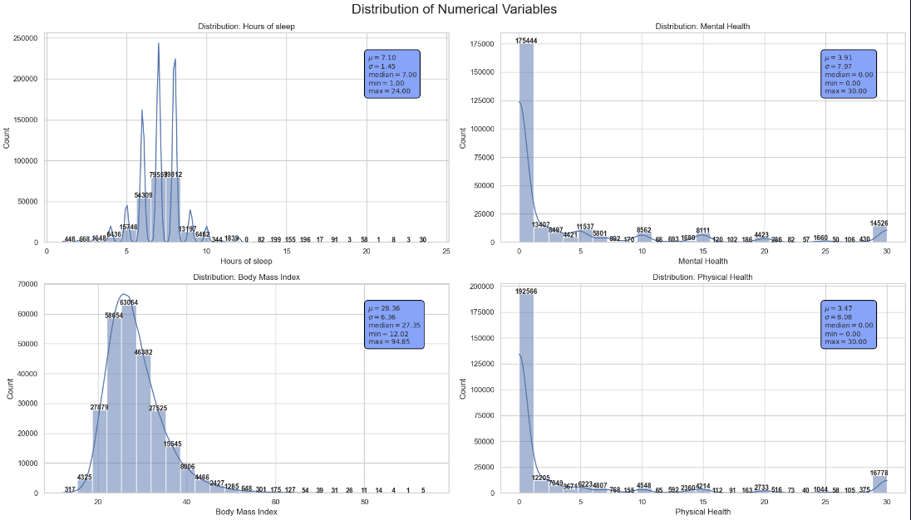
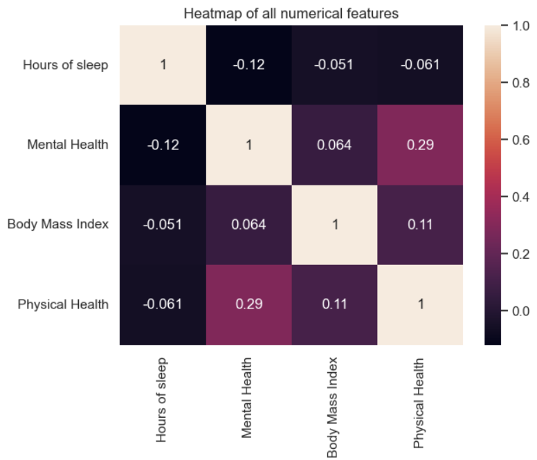
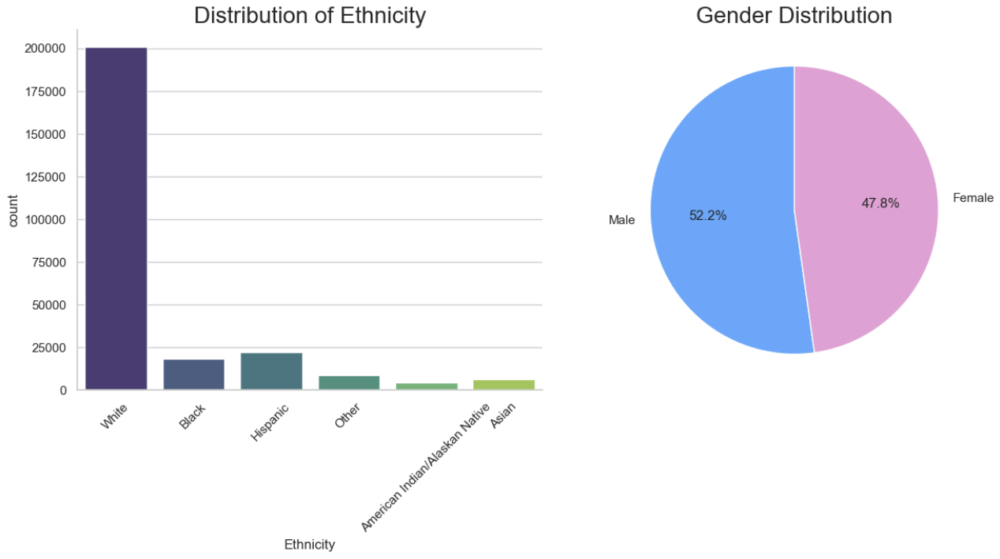
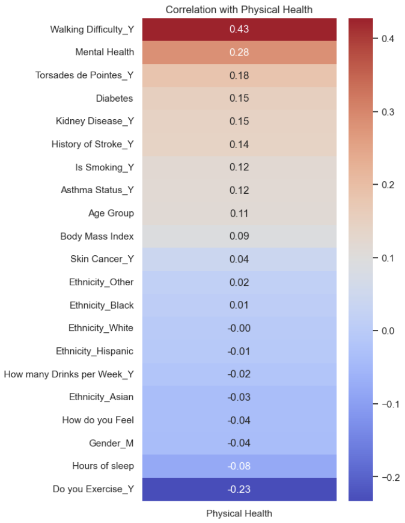
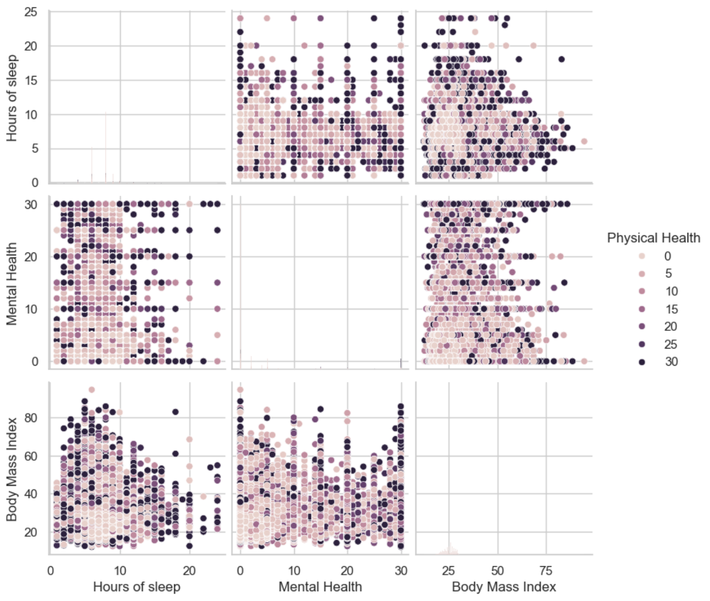
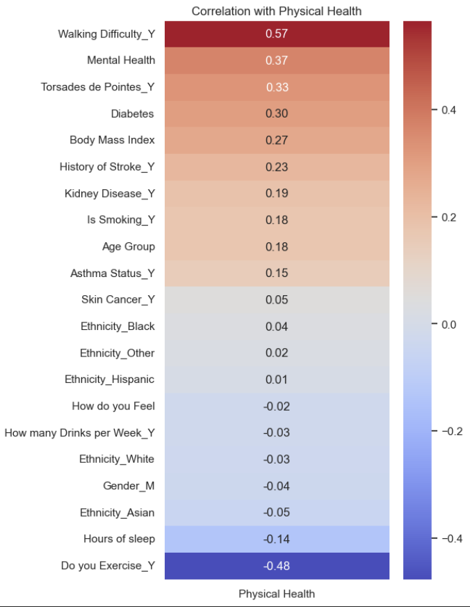
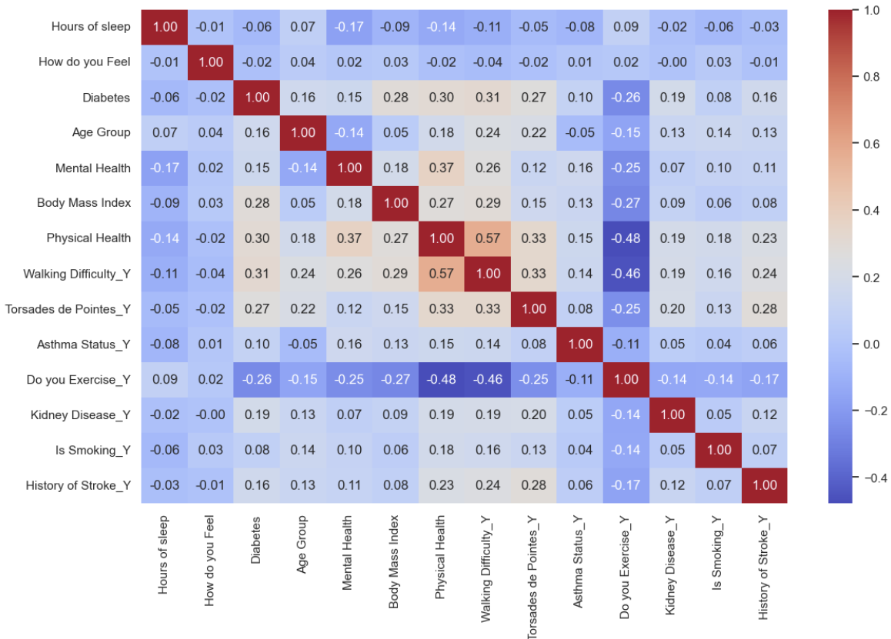
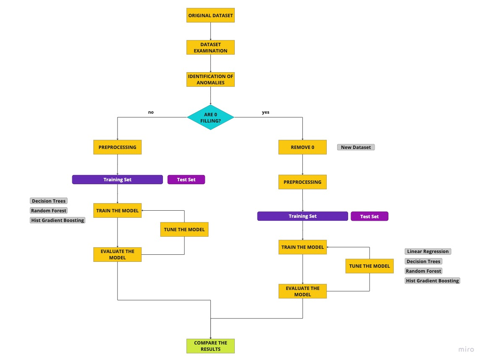
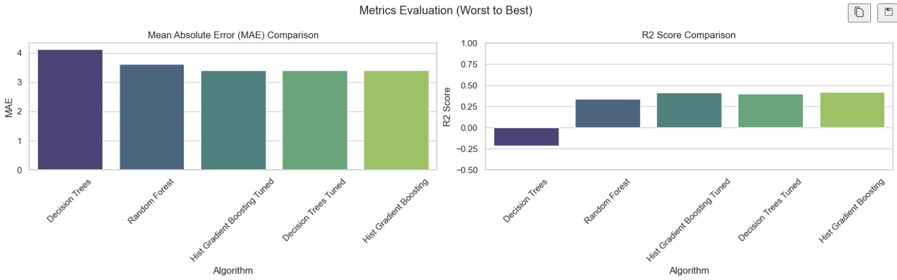
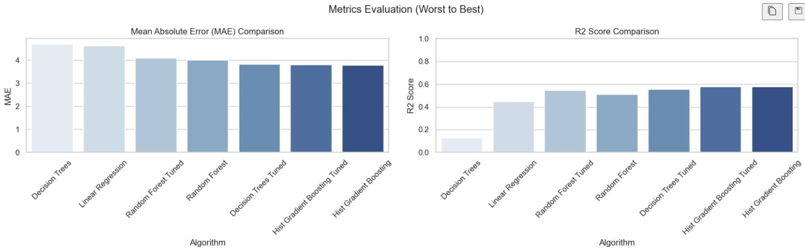

# MedCare Wellness Research Center 🩺

### Team Members
- Edoardo Cocciò 282401
- Alexandra Tabarani 282091
- Lorenzo Laterza 283121

## Introduction ✍️
*At MedCare Wellness Research Center, we embark on a groundbreaking journey to predict the `Physical health` of individuals using an extensive dataset encompassing 261,311 records.* Our ambitious project stands out in its scale and depth, delving into an array of factors that influence our physical health. The dataset is a rich tapestry of information, featuring a diverse range of attributes from physical and mental health assessments to lifestyle indicators such as exercise habits, sleep patterns, and other health status. Notably, it comprises a higher proportion of categorical variables (13 in total) compared to numerical ones (5), including the unique PatientID for each individual.

*Our approach is rooted in the OSEMN framework*, a robust and systematic pipeline that includes obtaining, scrubbing, exploring, modeling, and interpreting data. This comprehensive methodology ensures a meticulous and thorough analysis of the dataset. A key component of our project is an in-depth Exploratory Data Analysis (EDA), designed to uncover hidden patterns and insights, and visualizing our data. This step is crucial as it lays the foundation for subsequent phases of our research.

*Beyond EDA, our project extends into the critical realm of data preprocessing and model evaluation.* This phase is fundamental in transforming our extensive dataset into a form that's primed for effective machine learning analysis. Key preprocessing steps include meticulous scaling and encoding, tailored specifically to suit the unique composition of our dataset. It's a process that not only prepares the data but also enables us to uncover and understand latent patterns and relationships, which are crucial for boosting the performance and predictive accuracy of our target variable.

*Our approach is characterized by a rigorous experimentation with a variety of machine learning models.* This phase is not just about applying algorithms; it's about a meticulous and iterative process of fine-tuning each model to achieve optimal performance. We thoroughly test various models, adjusting and calibrating them to hone in on the most effective techniques for predicting physical health outcomes. 

## Methods 🔍

Our project at MedCare Wellness Research Center started with a comprehensive analysis of a large dataset, using a suite of Python libraries, including Pandas, NumPy, Scikit-learn, Seaborn, and Plotly. This exploration was crucial to understand the dataset's unique characteristics, including its structure and the distribution of various variables. We diligently followed the OSEMN pipeline, focusing initially on obtaining, scrubbing, and exploring the data. This involved reading the dataset, preprocessing it to remove any anomalies, and identifying hidden patterns that could potentially enhance the predictability of our target variable. Let’s start with OSE:

### Dataset Examination

The EDA started with a thorough examination of the dataset, focusing on understanding its structure, the distribution of variables, and any initial trends or patterns. 
Then we focused on understanding the distribution of numerical variables like `Hours of Sleep`, `Mental Health`, `Physical health` and `BMI`. These univariate analyses were revealing, showing multimodal distributions in some variables and skewed distributions in others, such as mental health and physical health scores.Our team attempted to address these skewness issues with log transformations, but the results were not as effective as we hoped. 

Additionally, we used heatmaps to identify correlations among numerical variables.

Moreover, we used boxplots in order to compare our target variable with respect to all the other categorical variables, and we made a pie chart for gender distribution and a countplot for ethnicity distribution to check whether these variables were balanced or not, discovering that gender is quite balanced while ethnicity is clearly unbalanced, with a majority of the white ethnicity. 

### Identification of Anomalies

During the initial EDA, we noticed a few anomalies in the dataset. Specifically, we observed that some features, such as `Physical Health` and `Mental Health`, were extremely skewed. This skewness caused an imbalance in the dataset that affected the performance of our models. Moreover after a bivariate analysis it appears that patients' feelings are exactly the opposite of their health score. We initially assumed that a high health score meant that the patient was healthy, but after this analysis we saw that lots of patients that were feeling poor had a physical health score above 15, while those feeling good, very good and excellent have a physical health score around zero **we had to reconsider the meaning of the score `Physical Health`, with a high value indicating that the patient is ill and a low value meaning that the patient is healthy.**

As the features `Mental Health` and `Physical Health` both have most of their data with a value of 0 another possible interpretation could be that those are filling values, but removing the 0 values of both these columns meant reducing drastically the size of our dataset, and also removing all those 0 that weren’t filling values.

*For this reason we decided to first build our models on the entire dataset, removing only the outliers identified using our domain knowledge, and then build the same models on a reduced dataframe where entries with a physical health value of zero, suspected to be filler values, were removed.*

### Preprocessing

In the preprocessing stage for the complete dataset, we removed potential outliers, such as individuals with unusually high or low BMI values or those sleeping more than 12 hours per day. We also removed the `PatientID` feature, which was deemed irrelevant. The dataset then underwent encoding processes, including label and one-hot encoding, tailored to the nature of our data. Subsequent correlation analysis led to the elimination of certain variables that showed minimal correlation with physical health, including ethnicities, gender, skin cancer, and alcohol consumption data, as we can see in the following chart:

The dataset was then split into training and testing subsets, followed by scaling, to prepare it for the modeling phase.

### Model Selection and Problem Definition

We recognized our project's core objective as a regression problem, due to the continuous nature of our target variable, for this reason we opted for decision trees, random forests, and histogram-based gradient boosting models. These models were selected for their compatibility with our data and the specific requirements of our analysis. The rationale behind choosing these models, along with the specifics of their tuning and the metrics used to evaluate their performance, will be elaborated in the Experimental Design section that will be dedicated to Model and Interpretation phases of the OSEMN.

### Second Exploration and Analysis

The second phase of our analysis at MedCare Wellness Research Center involved a refined approach to the dataset, focusing on a more rigorous data cleaning process and exploring multivariate relationships by reshaping the dataset based on domain knowledge and statistical methods, driven by our hypothesis that some entries with a physical health score of 0 were fillers and not representative of actual health conditions. 

### Data Filtering and Cleaning

In this phase we removed entries that had a `Physical Health`  score of 0 setting some specific conditions which take into account several hypotheses related to it, for example `Mental Health`, `How do you Feel`, `Do you Exercise`and others.
Those indicators suggest the impossibility of having perfect health in the presence of certain conditions like walking difficulty, poor or fair self-reported health, no exercise, extreme BMI values, and others. This operation resulted in a removal of around 100.000 data.
 
### Multivariate and Univariate Analysis 

Following the data filtering, we conducted a multivariate analysis using pair plots to identify patterns and relationships between different variables and the target variable 'Physical Health'. This analysis provided insights into clusters of low physical health scores associated with healthier ranges in other variables, like BMI and hours of sleep. Univariate analysis was also performed to understand the distributions of 'Hours of Sleep', 'Mental Health', 'BMI', and 'Physical Health'. We observed significant skewness in these distributions like in the first EDA, which we attempted to mitigate with log transformations this time obtaining better results especially for 'Hours of Sleep' and 'BMI', resulting in more symmetric, bell-shaped distributions.

### Encoding and Correlation Analysis

The dataset underwent encoding processes for categorical variables using one-hot and label encoding. A correlation heatmap was then created to understand the relationships between different variables and the target variable. Based on this, variables with negligible correlations, such as `Ethnicity_Black`,`Ethnicity_Asian`,`Gender_M` and others, were considered for removal, as we can see in the following chart:

After the removal we create another Heatmap this time with only the most relevant features.

### Dataset Splitting, Scaling, and Reflection

The dataset was split into training and test sets, and scaling was applied to ensure uniformity in magnitude. 

### Model Selection and Problem Definition

In this phase we selected Linear Regression, Decision Trees, Random Forests, and Hist Gradient Boosting models. These models were implemented to compare the results we obtained in our first analysis, but now we also added Linear Regression because as it’s a model very sensitive to non-normalized data we want to emphasize the result obtained after the transformation of the dataset. In fact due to the inconsistent results obtained after we implemented log transformations it was impossible for us to get some useful insights implementing it before.

We have synthesized our journey into a flowchart to provide readers with a clear overview of the steps we followed.

### Flowchart

## Experimental design 🔬

Our project's experimental design was methodically organized into two distinct phases, each pivotal in assessing the influence of data preprocessing on the performance of various predictive models.

1. **Phase One - Baseline Model Evaluation**:
 The initial phase focused on evaluating a suite of predictive models using the original dataset. The primary objective here was to establish baseline benchmarks. This was crucial for understanding the initial predictive capabilities of each model and observing how they interacted with the complexities of our dataset. This phase served as the foundation for comparison in our subsequent analysis.

2. **Phase Two - Impact of Refined Data Preprocessing**:
 In the second phase, the same set of models was reassessed, but this time on a dataset that had undergone extensive preprocessing. The aim was to measure the effect of this refined data treatment on model performance, offering a comparative analysis against our established baselines.

*Model Selection and Rationale*
- *Linear Regression*: Implemented only in the second phase as a baseline model due to its sensitivity to outliers and non-linearities. The original dataset's extreme skewness made it challenging to glean meaningful interpretations from this model initially.
- *Decision Trees*: Chosen for their capacity to model non-linear relationships, offering insights into the dataset's complex structure.
- *Random Forest*: Selected for its ability to mitigate overfitting issues seen in decision trees, thereby enhancing accuracy.
- *Hist Gradient Boosting*: Preferred for its efficiency in handling large datasets and its adeptness in managing missing values. 

Each model was meticulously tuned to ensure optimal performance, taking into account the unique characteristics of our dataset.

*Evaluation Metrics: Precision in Measurement*
Our choice of evaluation metrics was guided by the need for accuracy and relevance in a regression setting:
- *Mean Absolute Error (MAE)*: Chosen for its straightforward representation of the average error magnitude, offering a direct understanding of model accuracy.
- *Mean Squared Error (MSE)*: Utilized for its ability to highlight larger errors, a critical aspect when assessing model reliability.
- *R-squared (R^2)*: Employed to quantify the percentage of variance in the 'Physical Health' score that our models could explain, providing a measure of the models' explanatory power.

Through this structured and meticulous experimental design, we aimed to not only assess the performance of various models under different conditions but also to understand the deeper impacts of data preprocessing on our predictive capabilities.

## Results 🏅

In the first phase of our project, where we utilized the initial dataset, the results from our models indicated a modest level of predictive ability. Notably, the Hist Gradient Boosting model struck a balance between performance complexity and accuracy. This was evidenced by its Mean Absolute Error (MAE) and R-squared values, which pointed to a reasonable, yet not exceptional, level of accuracy and ability to explain the variance in the dataset.
These initial findings were pivotal as they brought to light the critical need for model tuning. The moderate performance across the board suggested that while our models were on the right track, there was significant room for improvement, especially in terms of enhancing their predictive capabilities. This was particularly evident in their limited success in capturing the full spectrum of variance within our complex dataset.
The results from this phase underscored an important insight: a more selective approach in data preprocessing could potentially lead to better model performance. It became clear that fine-tuning our models and perhaps even adopting a more targeted selection of the data could yield more accurate and reliable predictions. This understanding guided our next steps, where we would delve deeper into optimizing our models and exploring the impact of refined data selection on their performance.

Upon revising the dataset to exclude potential filling values, we embarked on the second phase of our model evaluation. This step involved a re-assessment of the models with the newly refined dataset, leading to notably enhanced performances. 
This phase marked a clear improvement in accuracy and reliability across all models, as evidenced by reduced Mean Absolute Error (MAE) and increased R-squared values. These metrics were especially pronounced in the performance of the Hist Gradient Boosting model, which emerged as the standout performer. The enhanced dataset allowed this model to excel, showcasing its superior capability in predicting physical health outcomes.
The positive outcomes of this phase reinforced the value of our data cleaning and refinement process. It became evident that our approach to data selection and preprocessing was instrumental in elevating the predictive power of our models. This phase not only demonstrated the overall improvements in model performance but also highlighted the proficiency of the Hist Gradient Boosting model in our refined context.

## Conclusions 🖊️

In this group project, we had the invaluable opportunity to apply and refine our practical knowledge in the field of predictive modeling for healthcare data analysis. This experience allowed us to delve deep into the complexities of working with real-world health data, developing our understanding and skills in data preprocessing, model selection, tuning and interpretation of the results.
This experience was not just about applying theoretical knowledge; it was a practical foray into the intricacies of real-world data and the subtleties of model behavior. We emerged from this project with a refined understanding of how data tells a story in the healthcare context and how our role is pivotal in interpreting and presenting this narrative.

Yet, as with any rigorous scientific inquiry, our project opened doors to new questions and paths for exploration. We made significant headway in improving model accuracy, yet some aspects of physical health prediction remain not fully uncovered. 
Looking forward, there's a promising avenue in enhancing our approach to filtering out potential filler values. By refining this filtering process, we anticipate uncovering deeper, more subtle patterns within the dataset, potentially leading to further breakthroughs in predictive accuracy. Future endeavors could involve a more intricate analysis of these aspects, possibly integrating more nuanced data points or employing advanced modeling techniques that can better capture the complex tapestry of factors influencing physical health.

In wrapping up our work with the MedCenter dataset, it's like we've been doctors using data to understand people's health. Just like doctors use symptoms to figure out what's wrong with someone, we used data to predict how healthy people might be!

Our project showed how important data analysis is in healthcare. We used machine learning to find patterns in the data, which helped us understand how different things affect people's health. It's like using a stethoscope to listen to someone's heart, but we were listening to the data.

In conclusion,  this project was more than an academic endeavor; it was a step into the future, demonstrating the incredible potential of technology in healthcare. Our findings lay the groundwork for future research, offering a glimpse into a world where healthcare is driven by data, tailored to individual needs, and more proactive in preventing illness!
